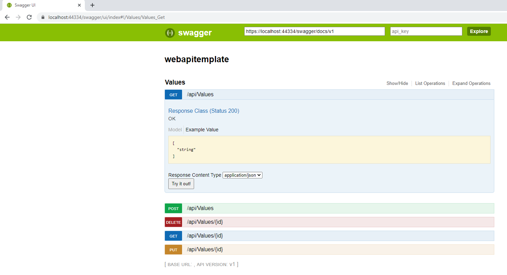
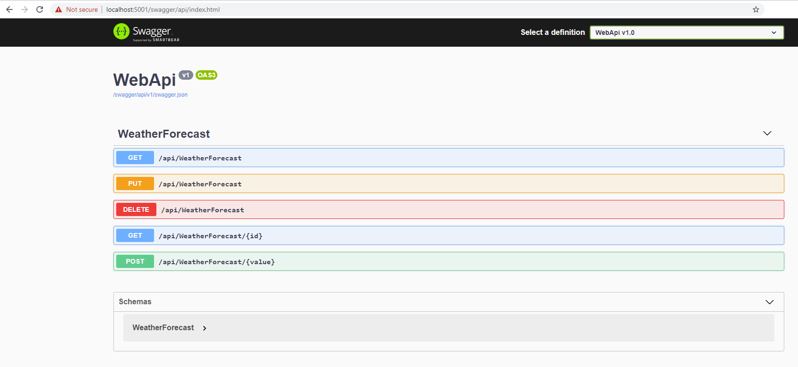

# Swagger Template WebApi

Simple Swagger API template for .NET Framework 4.8 and .Net 5

## .NET Framework 4.8

### Usage 4.8

Download or Clone the repo. Build the project and run it. Then, access the following URL: <https://localhost:44334/swagger/ui/index> and you will see the Swagger UI loading up:


## .NET Core 5.0

### Usage 5.0

Download or Clone the repo. Build the project and run it. Then, access the following URL: <https://localhost:5001/swagger/api/index.html> and you will see the Swagger UI loading up:


Install the following packages:

```json
    <PackageReference Include="Serilog" Version="2.10.0" />
    <PackageReference Include="Swashbuckle.AspNetCore" Version="5.6.0" />
    <PackageReference Include="Swashbuckle.AspNetCore.Annotations" Version="5.6.0" />
    <PackageReference Include="Microsoft.AspNetCore.Mvc.NewtonsoftJson" Version="5.0.0" />
    <PackageReference Include="Serilog.AspNetCore" Version="3.4.0" />
    <PackageReference Include="Serilog.Sinks.Console" Version="3.1.1" />
    <PackageReference Include="Swashbuckle.AspNetCore.Swagger" Version="5.6.0" />
```

Then add the following code in the `startup.cs`:

```c#
public void ConfigureServices(IServiceCollection services)
{
    services.AddSwaggerGen(options => {
        options.SwaggerDoc("v1", new OpenApiInfo() { Title = "WebApi", Version = "v1" });
    })
    .AddMvc(options => {
        options.Filters.Add(new ExceptionFilter());
        options.Filters.Add(new ProducesAttribute("application/json"));
        options.ModelBindingMessageProvider.SetValueMustNotBeNullAccessor((_) => "The field is required.");
    });

    services.AddControllers().AddNewtonsoftJson(options =>
    {
        options.SerializerSettings.DateTimeZoneHandling = DateTimeZoneHandling.RoundtripKind;
        options.SerializerSettings.ContractResolver = new CamelCasePropertyNamesContractResolver();
    });
    services.AddMvc(option => option.EnableEndpointRouting = false);
}
```

```c#
public void Configure(IApplicationBuilder app, IWebHostEnvironment env, ILoggerFactory loggerFactory)
{
    var logEventLevel = LogEventLevel.Debug;
    var applicationName = "SwaggerTemplateAPI";
    Log.Logger = new LoggerConfiguration()
                    .MinimumLevel.Is(logEventLevel)
                    .WriteTo.Console()
                    .CreateLogger();

    Log.Information("Starting...");

    loggerFactory.AddSerilog();

    _ = app.UseSwagger(options =>
        {
            options.RouteTemplate = "swagger/api/{documentname}/swagger.json";
        })
    .UseSwaggerUI(options =>
    {
        options.SwaggerEndpoint("/swagger/api/v1/swagger.json", $"{applicationName} v1.0");
        options.RoutePrefix = "swagger/api";
    })
    .UseMvc();
}
```

And create an `ExceptionFilter` class:

```c#
public class ExceptionFilter : ExceptionFilterAttribute
{
    public override void OnException(ExceptionContext exceptionContext)
    {
        exceptionContext.Result = new ObjectResult(exceptionContext.Exception.Message)
        {
            StatusCode = StatusCodes.Status500InternalServerError
        };

        base.OnException(exceptionContext);
    }
}
```

Then browse your swagger API and you should see all the different end-points there.
